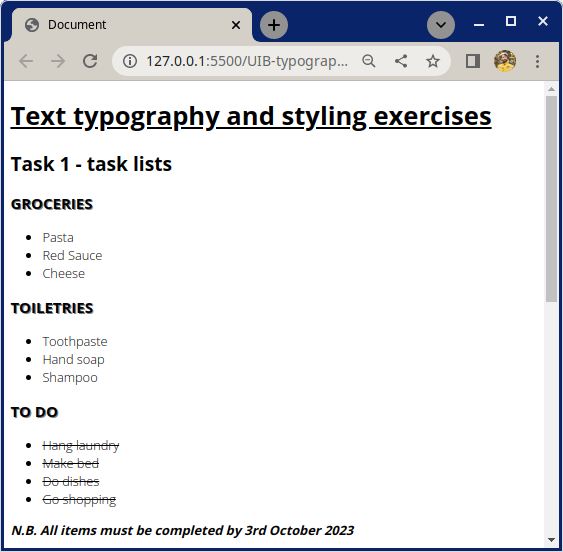
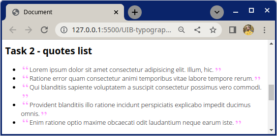
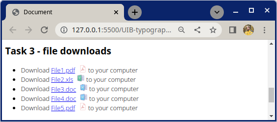
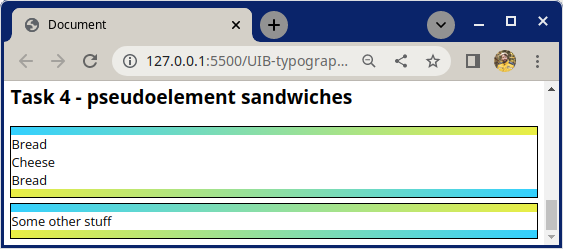

# Shopping List

This exercise is a series of typography tasks.

## What you will be doing

Work in the included HTML file and create a CSS file called `style.css`. After that complete the tasks below. Good luck!

## Tasks

### Task 1

- Choose a font on google fonts and import using the HTML link tag.
- Select different font weights e.g. light(300), regular(400), bold(700).
- Apply the font to all the elements on the page.
- Underline the h1 heading.
- Give all list items a light *300* font weight.
- Give all headings with the class `.heading` a shadow and, in CSS, make all these elements appear uppercase.
- Give the element with the class `.note` a bold font weight. Make the text appear italic.
- Strike through all the elements with the class `.todo-item`.

### Task 2

- Generate an unordered list of lorem ipsum quotes using emmet.
- Apply pseudo elements to place a quote icon before and after each quote.
- Use the included `quote.png` for the source image
- Hint: you can rotate an element using `rotate:180deg;`

### Task 3

- Using pseudo elements, replicate the file link list shown below.
- After each file name in the link list we want to display the corresponding file type as an icon
  - Include the following file types in the link list: `.pdf`,`.xls`, `.doc`
  - Icons
    - PDF: https://img.icons8.com/officel/64/000000/pdf.png
    - XLS: https://img.icons8.com/dusk/64/000000/ms-excel.png
    - DOC: https://img.icons8.com/dusk/64/000000/ms-word.png
- Use attribute selectors to select files by type and then use a pseudo element to place the matching file type icon after each list entry

### Task 4

- Using pseudo elements `::before` and `::after`, create the 'sandwich div' shown below.
- *Hint*: don't use the `border` for the gradients
    - Make the pseudo elements block level elements
    - Add width and height and give the pseudo elements a linear gradient background

